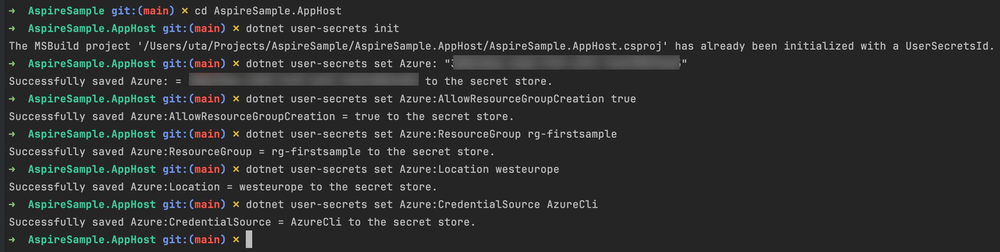

# Pragmatic Microservices with C# and Azure

##### Nagel


“Pragmatyczne Mikrousługi z C# i Azure” wprowadza .NET Aspire dla mikrousług, koncentrując się na definiowaniu modelu aplikacji, korzystaniu z wykrywania usług oraz integracji z natywnymi usługami chmurowymi Azure. Napisana przez Microsoft MVP i doświadczonego architekta oprogramowania z ponad dwudziestoletnim doświadczeniem w .NET, książka ta pomoże Ci opanować rozwój solidnych usług z wykorzystaniem funkcji .NET, takich jak minimalne interfejsy API, gRPC oraz SignalR dla komunikacji w czasie rzeczywistym. Oprócz omówienia kluczowych aspektów DevOps, takich jak metodyki testowania, w tym testy jednostkowe, integracyjne i obciążeniowe, poznasz również logowanie i monitorowanie, w tym OpenTelemetry przy użyciu narzędzi takich jak Azure Log Analytics, Application Insights, Prometheus oraz Grafana. Nauczysz się także komunikacji asynchronicznej z wykorzystaniem kolejek i zdarzeń poprzez Azure Event Hub i Apache.


W trakcie książki aspekty teoretyczne będą uzupełniane praktycznymi umiejętnościami zdobytymi podczas budowy i wdrażania w pełni funkcjonalnej aplikacji opartej na mikrousługach. Na końcu książki posiądziesz dogłębną wiedzę o architekturze mikrousług, praktyczne doświadczenie z różnymi technologiami .NET i usługami Azure oraz umiejętność projektowania, budowy, wdrażania i zarządzania aplikacjami mikrousługowymi efektywnie w środowiskach lokalnych i chmurowych.

## Przedmowa

.NET Aspire to nowy, precyzyjnie zdefiniowany framework oferujący narzędzia i biblioteki do tworzenia mikrousług z użyciem .NET, niezależnie od tego, czy mają działać lokalnie, na platformie Microsoft Azure, czy w innych środowiskach chmurowych. W tej książce dowiesz się, jak w pełni wykorzystać .NET Aspire podczas budowy swoich rozwiązań.


Tworzenie minimalnych interfejsów API ASP.NET Core (łatwa i szybka opcja do tworzenia usług REST) to jedynie niewielka część aplikacji opartej na architekturze mikrousługowej. Książka ta obejmuje wszystkie aspekty potrzebne do budowania kompleksowego rozwiązania. Znajdziesz tu dostęp do baz danych, zarówno relacyjnych, jak i NoSQL; używanie Docker i wdrażanie obrazów Docker; automatyczne wdrażanie za pomocą GitHub Actions; monitorowanie rozwiązania za pomocą logowania, danych o metrykach i śledzenia rozproszonego; tworzenie testów jednostkowych, integracyjnych i obciążeniowych; automatyczne publikowanie rozwiązania w różnych środowiskach oraz korzystanie z komunikacji binarnej, czasu rzeczywistego i asynchronicznej – wszystko to jest omówione w książce.


Poprzez kod dostarczony w tej książce będziesz pracować nad rozwiązaniem backendowym do obsługi ciekawej gry. Już od drugiego rozdziału uzyskasz funkcjonalność, którą można wykorzystać i przetestować, a każdy kolejny rozdział wzbogaci ją o kluczowe aspekty związane z mikrousługami. Jeśli nie chcesz przechodzić przez każdy rozdział po kolei, przygotowaliśmy kod, od którego możesz zacząć dla każdego z rozdziałów.


Aplikacja może działać na platformie Microsoft Azure, wykorzystując szereg usług, takich jak Azure Container Apps, Container Registry, Cosmos DB, App Configuration, Key Vault, Redis oraz SignalR Service. Może również działać lokalnie w klastrze Kubernetes, używając Kafka, Redis i innych zasobów.


Po zakończeniu tej książki zdobędziesz pewność w implementowaniu stabilnego, wydajnego i skalowalnego rozwiązania oraz korzystaniu z różnych usług Azure, które idealnie nadają się do hostowania rozwiązań opartych na mikrousługach. Choć przykładowym rozwiązaniem w książce jest gra, zdobyta wiedza pomoże Ci stworzyć każdą architekturę usługową dla celów biznesowych.


**Dla kogo jest ta książka**

Książka jest przeznaczona dla programistów i architektów oprogramowania, którzy znają C# i .NET, mają podstawową wiedzę o Microsoft Azure i chcą poznać wszystkie aspekty tworzenia nowoczesnych mikrousług z użyciem .NET i Microsoft Azure.


**Czego dotyczy ta książka**


​	•	**Rozdział 1, Wprowadzenie do .NET Aspire i Mikrousług**, przedstawia .NET Aspire oraz narzędzia i biblioteki pomocne w tworzeniu mikrousług. Utworzysz początkowy projekt .NET Aspire i dowiesz się, z czego się składa, oraz jakie elementy .NET Aspire mogą być przydatne. Poznasz także usługi używane w aplikacji Codebreaker, którą budujemy we wszystkich rozdziałach książki, oraz usługi dostępne na platformie Microsoft Azure.

​	•	**Rozdział 2, Minimalne API – Tworzenie Usług REST**, rozpoczyna proces tworzenia aplikacji Codebreaker. Nauczysz się korzystać z technologii ASP.NET Core minimal API do efektywnego tworzenia usług REST, używania OpenAPI do opisu usług oraz testowania usług za pomocą plików HTTP.

​	•	**Rozdział 3, Zapisywanie Danych do Baz Relacyjnych i NoSQL**, dodaje bazę danych do przechowywania danych w Azure SQL i Azure Cosmos DB, porównując bazy relacyjne i nierelacyjne oraz wykorzystując EF Core.

​	•	**Rozdział 4, Tworzenie Bibliotek dla Aplikacji Klientów**, dodaje biblioteki klienckie do dostępu do usług, z wariantem opartym na fabryce klienta HTTP i drugim korzystającym z Kiota do automatycznego generowania kodu klienta.

​	•	**Rozdział 5, Konteneryzacja Mikrousług**, omawia Docker i tworzenie obrazów Docker dla utworzonych dotychczas usług, w tym obrazu .NET native AOT, który pozwala na tworzenie obrazów Docker bez środowiska wykonawczego .NET.

​	•	**Rozdział 6, Microsoft Azure dla Hostingu Aplikacji**, uczy publikowania aplikacji w środowisku Azure Container Apps, wykorzystując do tego Azure Developer CLI i .NET Aspire.

​	•	**Rozdział 7, Elastyczne Konfiguracje**, omawia konfigurację .NET, dostawców konfiguracji oraz dodawanie konfiguracji i sekretów z Azure Container Apps, integrując Azure App Configuration i Azure Key Vault.

​	•	**Rozdział 8, CI/CD – Publikowanie z GitHub Actions**, obejmuje automatyczne budowanie i testowanie aplikacji oraz automatyczne aktualizowanie rozwiązań na Microsoft Azure z wykorzystaniem GitHub Actions.

​	•	**Rozdział 9, Uwierzytelnianie i Autoryzacja dla Usług i Klientów**, przedstawia integrację z Azure Active Directory B2C dla wersji chmurowej oraz tożsamości ASP.NET Core dla wersji lokalnej.

​	•	**Rozdział 10, Testowanie Rozwiązania**, omawia tworzenie testów jednostkowych, integracyjnych oraz testów end-to-end przy użyciu Playwright.

​	•	**Rozdział 11, Logowanie i Monitorowanie**, obejmuje logowanie wydajnościowe, pisanie danych o metrykach oraz śledzenie rozproszone, korzystając z OpenTelemetry, Prometheus, Grafana, Azure Application Insights oraz Azure Log Analytics.

​	•	**Rozdział 12, Skalowanie Usług**, zawiera testowanie obciążeniowe i wybór między skalowaniem pionowym a poziomym, a także dodanie pamięci podręcznej Redis dla zwiększenia wydajności.

​	•	**Rozdział 13, Komunikacja w Czasie Rzeczywistym z SignalR**, omawia informowanie klientów w czasie rzeczywistym przy użyciu Azure SignalR Service.

​	•	**Rozdział 14, gRPC dla Komunikacji Binarnej**, zwiększa wydajność komunikacji między usługami dzięki gRPC, tworzeniu definicji Protocol Buffers oraz korzystaniu z odkrywania usług .NET i .NET Aspire.

​	•	**Rozdział 15, Komunikacja Asynchroniczna za pomocą Wiadomości i Zdarzeń**, wprowadza kolejki wiadomości i zdarzenia z Azure Event Hub i Kafka.

​	•	**Rozdział 16, Uruchamianie Aplikacji Lokalnie i w Chmurze**, omawia potrzeby produkcyjne przy uruchamianiu na platformie Azure oraz różnice między środowiskiem produkcyjnym a deweloperskim, wdrażając aplikację na Azure Kubernetes Service oraz na lokalnym klastrze Kubernetes.

**Aby w pełni skorzystać z tej książki**

Powinieneś znać C# i .NET oraz mieć podstawową wiedzę o Microsoft Azure. Konieczne jest zainstalowanie następujących narzędzi i aplikacji:

| Narzędzie                        | Instalacja                                                   |
| -------------------------------- | ------------------------------------------------------------ |
| Visual Studio 2022 (opcjonalnie) | [Pobierz](https://visualstudio.microsoft.com/downloads/)     |
| Visual Studio Code               | [Pobierz](https://code.visualstudio.com/download)            |
| Docker Desktop                   | [Instalacja Windows](https://docs.docker.com/desktop/install/windows-install/) <br> [Instalacja Mac](https://docs.docker.com/desktop/install/mac-install/) <br> [Instalacja Linux](https://docs.docker.com/desktop/install/linux-install/) |
| Subskrypcja Microsoft Azure      | [Aktywuj](https://azure.microsoft.com/en-us/free/)           |
| Azure CLI                        | [Zainstaluj](https://learn.microsoft.com/en-us/cli/azure/install-azure-cli) |
| Azure Developer CLI              | [Zainstaluj](https://learn.microsoft.com/en-us/azure/developer/azure-developer-cli/install-azd) |
| Emulator Azure Cosmos DB         | [Instrukcja](https://learn.microsoft.com/en-us/azure/cosmos-db/how-to-develop-emulator) |
| .NET Aspire                      | [Zainstaluj](https://learn.microsoft.com/en-us/dotnet/aspire/fundamentals/setup-tooling) |

Visual Studio 2022 jest jedynym oprogramowaniem z tej listy wymagającym Windows. Wszystkie pozostałe narzędzia są dostępne na Windows, macOS lub Linux. Na platformach innych niż Windows można korzystać z Visual Studio Code lub innych narzędzi do pracy z .NET i C#.

Aby korzystać z .NET Aspire z Visual Studio, musi być zainstalowana wersja co najmniej 17.10.0. Możesz użyć Visual Studio 2022 Community Edition.

Od **Rozdziału 6** potrzebna jest subskrypcja Microsoft Azure. Można ją aktywować bezpłatnie na stronie [Microsoft Azure](https://azure.microsoft.com/free), co daje około 200 USD w kredytach Azure dostępnych przez pierwsze 30 dni oraz kilka darmowych usług dostępnych później. Jeśli posiadasz subskrypcję Visual Studio Professional lub Enterprise, masz także co miesiąc darmowy dostęp do zasobów Azure – wystarczy aktywować tę opcję: [Aktywuj subskrypcję](https://visualstudio.microsoft.com/subscriptions/).

Jeśli korzystasz z wersji cyfrowej tej książki, zalecamy samodzielne wpisywanie kodu lub skorzystanie z repozytorium GitHub książki (link dostępny w kolejnej sekcji), aby uniknąć potencjalnych błędów związanych z kopiowaniem i wklejaniem kodu.

**Pobieranie przykładowych plików kodu**

Przykładowe pliki kodu do tej książki można pobrać z GitHub: [https://github.com/PacktPublishing/Pragmatic-Microservices-with-CSharp-and-Azure](https://github.com/PacktPublishing/Pragmatic-Microservices-with-CSharp-and-Azure).

Kod źródłowy używa .NET 8. Po wydaniu .NET 9 kod źródłowy w głównej gałęzi będzie korzystał z .NET 9, a zmiany zostaną opisane w plikach readme. W tym czasie kod źródłowy dla .NET 8 będzie dostępny w gałęzi `dotnet8`. Podczas aktualizacji kodu do nowszych wersji możesz również sprawdzić dodatkowe gałęzie zawierające zmiany.

W naszej bogatej ofercie książek i materiałów wideo mamy również inne pakiety kodu dostępne na GitHub: [https://github.com/PacktPublishing/](https://github.com/PacktPublishing/). Sprawdź!

**Konwencje używane w książce**

W książce stosowane są różne konwencje tekstowe.

- **Kod w tekście**: Wskazuje słowa kodu w tekście, nazwy tabel baz danych, folderów, plików, rozszerzeń plików, ścieżek, przykładowych adresów URL, danych wejściowych użytkownika i kont Twitter. Oto przykład: „Zamontuj pobrany plik obrazu dysku WebStorm-10*.dmg jako kolejny dysk w systemie”.

Blok kodu wygląda następująco:

```swift
public static class LiveGamesEndpoints
{
  public static void MapLiveGamesEndpoints(this 
    IEndpointRouteBuilder routes, ILogger logger)
  {
    var group = routes.MapGroup("/live")
```

Gdy chcemy zwrócić uwagę na konkretną część bloku kodu, odpowiednie linie lub elementy są wyróżnione **pogrubieniem**:

```swift
var builder = WebApplication.CreateBuilder(args);
builder.AddServiceDefaults();
builder.AddApplicationServices();
```

Wszelkie polecenia w wierszu poleceń lub wyjścia są zapisywane w następujący sposób:

```swift
dotnet new console -o LiveTestClient
```

**Pogrubienie**: Wskazuje nowy termin, ważne słowo lub słowa, które widzisz na ekranie. Na przykład słowa w menu lub oknach dialogowych są pogrubione. Oto przykład: „Kliknij pole wyboru **Enable Live Trace**, a następnie kliknij, aby zebrać informacje o **ConnectivityLogs**, **MessagingLogs** i **HttpRequestLogs**.”

**Wskazówki lub ważne uwagi**

Wyglądają tak.

**Kontakt**

Twoja opinia jako czytelnika jest dla nas bardzo ważna.

- **Ogólne opinie**: Jeśli masz pytania dotyczące jakiegokolwiek aspektu tej książki, napisz do nas na adres [customercare@packtpub.com](mailto:customercare@packtpub.com), podając tytuł książki w temacie wiadomości. W przypadku pytań i problemów związanych z kodem źródłowym możesz skorzystać z forum Dyskusje w repozytorium GitHub tej książki: [https://github.com/PacktPublishing/Pragmatic-Microservices-with-CSharp-and-Azure/discussions](https://github.com/PacktPublishing/Pragmatic-Microservices-with-CSharp-and-Azure/discussions).

- **Errata**: Chociaż dokładamy wszelkich starań, aby zapewnić dokładność naszych treści, błędy mogą się zdarzyć. Jeśli znalazłeś błąd w tej książce, będziemy wdzięczni za zgłoszenie go. Odwiedź [www.packtpub.com/support/errata](https://www.packtpub.com/support/errata) i wypełnij formularz.

- **Piractwo**: Jeśli znajdziesz nielegalne kopie naszych publikacji w jakiejkolwiek formie w internecie, bylibyśmy wdzięczni za podanie adresu lub nazwy witryny. Skontaktuj się z nami pod adresem [copyright@packt.com](mailto:copyright@packt.com), podając link do materiału.

- **Zostań autorem**: Jeśli masz wiedzę w określonej dziedzinie i jesteś zainteresowany napisaniem lub współtworzeniem książki, odwiedź [authors.packtpub.com](https://authors.packtpub.com).


## **Część 1: Tworzenie Mikrousług z .NET**

Część 1 wprowadza podstawową funkcjonalność aplikacji mikrousługowej. Zanim zagłębisz się w rozwój aplikacji Codebreaker, poznasz .NET Aspire – nowy, gotowy na chmurę stos technologiczny do budowy usług. Ta część obejmuje omówienie możliwości technologii, kluczowych funkcji, wprowadzenie do Microsoft Azure oraz przegląd komponentów składających się na aplikację Codebreaker. Następnie przystąpisz do kodowania z użyciem minimalnych API ASP.NET Core, tworzenia kodu do interakcji z danymi zarówno w bazach relacyjnych, jak i NoSQL za pomocą Entity Framework (EF) Core, z wykorzystaniem Azure Cosmos DB i SQL Server, oraz generowania bibliotek klienckich do dostępu do usługi REST. Jedno podejście opiera się na fabryce klienta HTTP, a drugie na Microsoft Kioata.

Każdy rozdział w tej części dostarcza funkcjonalną aplikację, która ewoluuje w kolejnych rozdziałach, co wzbogaca proces nauki.

Ta część zawiera następujące rozdziały:

- **Rozdział 1**: Wprowadzenie do .NET Aspire i Mikrousług
- **Rozdział 2**: Minimalne API – Tworzenie Usług REST
- **Rozdział 3**: Zapisywanie Danych do Baz Relacyjnych i NoSQL
- **Rozdział 4**: Tworzenie Bibliotek dla Aplikacji Klientów


**Wprowadzenie do .NET Aspire i Mikrousług**

Witamy w procesie tworzenia rozwiązania składającego się z mikrousług. Pierwszy rozdział dostarcza fundamentów dla rozwiązania mikrousługowego, które będzie rozwijane w tej książce.

Poznasz funkcje, jakie .NET Aspire oferuje dla mikrousług. W książce tworzymy rozwiązanie o nazwie Codebreaker. Dowiesz się, czym jest Codebreaker i z jakich części się składa. W ostatniej sekcji tego rozdziału poznasz usługi Azure, które będą wykorzystywane podczas tworzenia aplikacji aż do ostatniego rozdziału.

Pierwszy rozdział kładzie solidne podstawy.

W tym rozdziale dowiesz się o korzyściach, jakie .NET Aspire oferuje przy tworzeniu mikrousług, oraz zdobędziesz podstawową wiedzę potrzebną do pracy z tą technologią, w tym jak definiować model aplikacji, co oznacza on dla rozwoju i wdrażania, jak wykorzystywane jest odkrywanie usług oraz jak wdrażać zasoby Azure podczas debugowania rozwiązania lokalnie.

Otrzymasz ogólny przegląd aplikacji, którą tworzymy w tej książce, części rozwiązania oraz sposobu, w jaki różne usługi są połączone.

W tym rozdziale omówimy następujące tematy:

- Tworzenie projektów .NET Aspire
- Części składowe rozwiązania Codebreaker
- Korzystanie z Microsoft Azure z .NET Aspire
- Usługi Azure używane przez rozwiązanie Codebreaker


**Wymagania techniczne**

W tym rozdziale potrzebujesz .NET 8 z zestawem narzędzi .NET Aspire, Visual Studio lub Visual Studio Code, Docker Desktop oraz subskrypcję Microsoft Azure. Informacje na temat instalacji są wyjaśnione w tym rozdziale oraz w pliku readme repozytorium kodu źródłowego.

Kod dla tego rozdziału znajduje się w repozytorium GitHub: [https://github.com/PacktPublishing/Pragmatic-Microservices-with-CSharp-and-Azure](https://github.com/PacktPublishing/Pragmatic-Microservices-with-CSharp-and-Azure).

W folderze `ch01` znajdziesz projekty z wynikami tego rozdziału. Dostępne są następujące foldery:

- **Aspire**: Ten folder zawiera cztery projekty utworzone przy użyciu szablonu .NET Aspire do uruchomienia projektu .NET Aspire, w tym jedną usługę i aplikację internetową.
- **Azure**: Ten folder zawiera te same cztery projekty co poprzedni folder, rozszerzone o wykorzystanie zasobów Azure.

**Rozpoczęcie pracy z .NET Aspire**

.NET Aspire to nowa technologia .NET oferująca narzędzia i biblioteki, które ułatwiają tworzenie, debugowanie i wdrażanie rozwiązań .NET opartych na mikrousługach. We wszystkich rozdziałach tej książki będziemy korzystać z możliwości .NET Aspire.

> **Uwaga**  
> W tym rozdziale zdobędziesz podstawową wiedzę o działaniu .NET Aspire. W pozostałych rozdziałach będziemy szczegółowo wykorzystywać .NET Aspire i zagłębiać się w szczegóły.

Można go zainstalować przy użyciu interfejsu .NET CLI lub Visual Studio 2022. Pierwsza wersja .NET Aspire jest oparta na .NET 8, dlatego co najmniej .NET 8 jest wymagany do korzystania z .NET Aspire.

.NET Aspire wymaga .NET 8 i może być zainstalowany poprzez instalację pakietu .NET workload:

```swift
dotnet workload install aspire
```

Aby zobaczyć zainstalowane pakiety workload oraz wersję .NET Aspire, użyj następującego polecenia:


```swift
dotnet workload list
```

Jeśli używasz Visual Studio, skorzystaj z Visual Studio Installer i wybierz komponent **.NET Aspire SDK**, aby zainstalować .NET Aspire.

Aplikacje .NET Aspire są zaprojektowane do działania w kontenerach. Podczas lokalnego uruchamiania aplikacji projekty działają bezpośrednio w systemie, bez potrzeby korzystania z Docker Engine. Kontenery Docker są jednak używane przy wdrażaniu rozwiązania. Możemy (i będziemy) korzystać z dostępnych obrazów Docker jako części aplikacji. W tym celu wymagane jest środowisko uruchomieniowe kontenerów do pracy lokalnej. W tej książce używamy najpopularniejszego środowiska uruchomieniowego kontenerów – Docker Desktop. Docker Desktop jest bezpłatny do użytku osobistego i dla małych firm. .NET Aspire obsługuje również uruchamianie kontenerów z Podman.

Po zainstalowaniu .NET Aspire możesz utworzyć nowy projekt.

**Tworzenie projektu .NET Aspire**

Gdy .NET Aspire jest zainstalowany, możesz utworzyć nowy projekt zawierający usługę API i aplikację kliencką Blazor, używając następującego polecenia:

```swift
dotnet new aspire-starter -o AspireSample
```


Z tym szablonem tworzone są cztery projekty:

- **AspireSample.ApiService**: Ten projekt zawiera usługę REST, która wykorzystuje minimalne API ASP.NET Core.
- **AspireSample.Web**: Aplikacja ASP.NET Core Blazor, która wysyła żądania do usługi API.
- **AspireSample.ServiceDefaults**: Projekt biblioteki z kodem inicjalizacji współdzielonym przez wszystkie usługi w rozwiązaniu.
- **AspireSample.AppHost**: Projekt hosta aplikacji definiujący model aplikacji i sposób, w jaki wszystkie zasoby są połączone.


Teraz zbudujmy i uruchommy rozwiązanie.


####   **Dashboard .NET Aspire**

Po uruchomieniu nowo utworzonego projektu (projekt **AppHost** musi być projektem startowym) otwiera się konsola, pokazująca logi AppHost, a przeglądarka otwiera dashboard, który pokazuje zasoby projektu, jak widać na Rysunku 1.1.


 Dzięki dashboardowi .NET Aspire możesz zobaczyć działające zasoby (na przykład `apiservice` i `webfrontend` na ilustracji), stan zasobów oraz ich punkty końcowe, a także uzyskać dostęp do szczegółów i logów. W lewym panelu masz dostęp do logów, śladów oraz danych metryk. Chociaż dashboard zazwyczaj nie jest używany w środowiskach produkcyjnych (gdzie wykorzystujemy Prometheus, Grafana, Azure Application Insights i inne narzędzia), podczas fazy deweloperskiej jest niezwykle przydatny. Czy usługi mają wycieki pamięci? Jak przebiega interakcja między usługami? Gdzie znajdują się wąskie gardła? Wszystkie te informacje można znaleźć za pomocą dashboardu. Szczegółowe omówienie tego tematu znajdziesz w Rozdziale 11.

> **Uwaga**  
> Ponieważ dashboard .NET Aspire jest bardzo przydatny, jest dostępny jako obraz Docker i może być stosowany również w małych scenariuszach produkcyjnych. Jednak poza środowiskiem deweloperskim ma pewne ograniczenia.

Po kliknięciu w link `webfrontend` aplikacja się otwiera. Jeśli wcześniej tworzyłeś aplikacje Blazor, rozpoznasz linki z aplikacji, jak pokazano na Rysunku 1.2.


Klikając link **Weather** w lewym panelu, `webfrontend` wysyła żądanie do `apiservice`, aby uzyskać losowe informacje o pogodzie.

Aplikacja działa, więc teraz przejdźmy do wygenerowanego kodu dla .NET Aspire.

**Model aplikacji .NET Aspire**

Aby zacząć zgłębiać .NET Aspire, musisz poznać model aplikacji:

`AspireSample.AppHost/Program.cs`

```swift
var builder = DistributedApplication.CreateBuilder(args);
var apiService = builder.AddProject<Projects.AspireSample_ApiService>("apiservice");
// code removed for brevity
```

Jeśli jesteś zaznajomiony ze wzorcem `app builder` w aplikacjach .NET i klasą `Host` do konfigurowania kontenera DI, konfiguracji aplikacji oraz logowania, zauważysz pewne podobieństwa. Tutaj używana jest klasa `DistributedApplication` do utworzenia `IDistributedApplicationBuilder` za pomocą metody `CreateBuilder`. Zwrócony builder jest używany do definiowania wszystkich zasobów potrzebnych rozwiązaniu. W wygenerowanym kodzie dwa projekty są mapowane za pomocą metody `AddProject`. Projekty są referencjonowane za pomocą typu generycznego, na przykład `Projects.AspireSample_ApiService`. Ten typ powstał przez dodanie referencji do projektu `AspireSample.ApiService`. Referencję można zobaczyć, otwierając plik projektu `AspireSample.AppHost.csproj`.

Używanie typów projektów z `AddProject` jest wygodne, ale nie jest wymagane. Można również przekazać ścieżkę do katalogu, w którym znajduje się projekt.

Oprócz dodawania projektów, można dodać pliki wykonywalne (`AddExecutable`) lub obrazy Docker (`AddContainer`).

.NET Aspire oferuje również szeroką listę wstępnie zdefiniowanych zasobów, na przykład RabbitMQ, Kafka, Redis i SQL Server oraz zasoby działające na platformie Microsoft Azure, takie jak Azure Cosmos DB, Azure Key Vault i Azure Event Hub. Aby dodać zasoby do modelu aplikacji, należy dodać pakiety NuGet z prefiksami `Aspire.Hosting` i `Aspire.Hosting.Azure`.

> **Uwaga**  
> W tej książce do rozwiązania Codebreaker dodano wiele nowych zasobów. Rozdział 3 dodaje SQL Server i Azure Cosmos DB, Rozdział 5 dodaje kontenery Docker, Rozdział 7 dodaje Azure App Configuration i Azure Key Vault, Rozdział 11 dodaje Azure Log Analytics, Prometheus i Grafana, Rozdział 13 dodaje Azure SignalR Services i inne.

Nazwa "apiservice", przekazana jako parametr do metody `AddProject`, definiuje nazwę zasobu. Użyjemy tej nazwy później w sekcji **Odkrywanie usług**.

`AddProject` zwraca obiekt typu `IResourceBuilder<ProjectResource>`. Obiekty `IResourceBuilder` mogą być używane do połączenia wielu zasobów w ramach modelu aplikacji. Typ `ProjectResource` pochodzi od klasy bazowej `Aspire.Hosting.ApplicationModel.Resource` i implementuje kilka interfejsów zasobów, takich jak `IResourceWithEnvironment` i `IResourceWithServiceDiscovery`.

Użyjmy tego obiektu zasobu, aby połączyć kolejny zasób:

```swift
// code removed for brevity
builder.AddProject<Projects.AspireSample_Web>("webfrontend")
  .WithExternalHttpEndpoints()
  .WithReference(apiService);
builder.Build().Run();
```


Zmienna `apiService`, zwrócona z pierwszej metody `AddProject`, jest powiązana z drugim projektem – frontendem webowym – za pomocą metody `WithReference`. Pozwala to frontendowi na dostęp do usługi API. Adres URL usługi API jest przypisywany jako zmienna środowiskowa do frontendu, co umożliwia interfejs `IResourceWithServiceDiscovery`. Ponieważ dostęp do usługi API nie jest wymagany z zewnątrz (potrzebuje go tylko frontend), frontend webowy powinien być dostępny z zewnątrz. Dlatego metoda `WithExternalHttpEndpoints` jest używana z projektem frontendu. Informacje konfiguracyjne określają, jak skonfigurowany jest kontroler Ingress, dodany jako proxy do zasobu.

Zanim przyjrzymy się projektom referencjonowanym przez AppHost, zapoznajmy się z projektem współdzielonym **AspireSample.ServiceDefaults**.

**Projekt współdzielony dla wspólnej konfiguracji**

Projekt `AspireSample.ServiceDefaults` to biblioteka ze wspólną konfiguracją, która może być używana przez wszystkie projekty zasobów:

`Aspire/AspireSample.ServiceDefaults/Extensions.cs`

```swift
public static class Extensions
{
  public static IHostApplicationBuilder AddServiceDefaults(this 
    IHostApplicationBuilder builder)
  {
    builder.ConfigureOpenTelemetry();
    builder.AddDefaultHealthChecks();
    builder.Services.AddServiceDiscovery();
    builder.Services.ConfigureHttpClientDefaults(http =>
    {
      http.AddStandardResilienceHandler();
      http.AddServiceDiscovery();
    });
    return builder;
  }
  // code removed for brevity
```


Ten projekt współdzielony zawiera metodę rozszerzającą `AddServiceDefaults`, która implementuje wspólną konfigurację dla aplikacji zasobów. W implementacji wywoływana jest `ConfigureOpenTelemetry`, kolejna metoda rozszerzająca zdefiniowana przez klasę `Extensions`. Tutaj implementowane są elementy wspólne dla logowania, metryk oraz śledzenia rozproszonego, które zostaną omówione w Rozdziale 11. `AddDefaultHealthChecks` konfiguruje sprawdzanie kondycji dla usług, w tym dla komponentów .NET Aspire.

`AddServiceDiscovery` wykorzystuje bibliotekę `Microsoft.Extensions.ServiceDiscovery`, która jest nowością od pierwszego wydania .NET Aspire, ale może być używana niezależnie. Metoda `AddServiceDiscovery` rejestruje domyślne rozwiązania punktów końcowych usług. Odkrywanie usług jest konfigurowane nie tylko z kontenerem DI, ale także w konfiguracji klienta HTTP za pomocą parametru lambda w metodzie `ConfigureHttpClientDefaults`. Odkrywanie usług jest omówione w kolejnej sekcji. `ConfigureHttpClientDefaults` jest częścią biblioteki `Microsoft.Extensions.Http`, fabryki klienta HTTP. Pakiet referencjonowany z biblioteki `ServiceDefaults` to `Microsoft.Extensions.Http.Resiliency`. Ta biblioteka, nowa od wersji .NET 8, oferuje rozszerzenia do biblioteki Polly. W aplikacjach rozproszonych wywołania czasami zawodzą z powodu przejściowych problemów. Powtórzenie wywołania tych zasobów może zakończyć się powodzeniem przy kolejnym wywołaniu. Funkcjonalność ta jest wbudowana w .NET Aspire z domyślną konfiguracją odporności w `AddStandardResilienceHandler`.

Przejdźmy teraz do odkrywania usług.

**Używanie odkrywania usług**

`webfrontend` musi znać link do `apiservice`, aby uzyskać informacje o pogodzie. Link ten różni się w zależności od środowiska, w którym działa rozwiązanie. Podczas uruchamiania aplikacji lokalnie na systemie deweloperskim używamy linków `localhost` z różnymi numerami portów, a w zależności od środowisk (na przykład Azure Container App, Kubernetes itp.) wymagane są różne konfiguracje.

Dzięki nowemu odkrywaniu usług można używać logicznych nazw dla usług, które są rozwiązywane przy użyciu różnych dostawców. W ten sposób ta sama funkcjonalność działa w różnych środowiskach.

Aplikacja kliencka Blazor konfiguruje `HttpClient`:

`Aspire/AspireSample.Web/Program.cs`

```swift
builder.Services.AddHttpClient<WeatherApiClient>(client =>
{
  client.BaseAddress = new("https+http://apiservice");
});
// code removed for brevity
```

Nazwa `apiservice` pochodzi z definicji modelu aplikacji – nazwa została przekazana do metody `AddProject`. Przed dwukropkiem można określić schemat, na przykład `http` lub `https`. Rozdzielenie schematów znakiem `+` pozwala na użycie wielu schematów, z preferencją dla pierwszego z nich.

Metoda `AddServiceDiscovery`, która została dodana wcześniej do kontenera DI, domyślnie dodaje rozwiązanie punktów końcowych oparte na konfiguracji. Dzięki temu konfigurację można dodać do pliku konfiguracyjnego JSON, na przykład w następujący sposób:

```swift
{
  "Services": {
    "apiservice": {
      "https": [
        "localhost:8087",
        "10.466.24.90:80"
      ]
    }
  }
}
```

W konfiguracji sekcja powinna być nazwana **Services**. W sekcji **Services** wyszukiwane są nazwane usługi (np. `apiservice`), a następnie rozwiązywane są wartości poniżej nazwy schematu (`https`). Numery portów są losowo tworzone i mogą różnić się w zależności od środowiska.

Ponieważ w AppHost `apiservice` jest wywoływany z frontendu webowego, URI usługi API są dodawane jako zmienne środowiskowe. Otwórz dashboard .NET Aspire i w kolumnie **Details** kliknij **View** przy `webfrontend`. Zobaczysz tam zmienne środowiskowe `services__apiservice_http__0` i `services__apiservice_https_0`, a także wartości `http://localhost:5402` i `https://localhost:7441`. URI są określone w pliku `Properties/launchsettings.json`:

`Aspire/AspireSample.ApiService/Properties/launchSettings.json`

```swift
{
  "$schema": "https://json.schemastore.org/launchsettings.json",
  "profiles": {
    "http": {
      "commandName": "Project",
      "dotnetRunMessages": true,
      "launchBrowser": true,
      "launchUrl": "weatherforecast",
      "applicationUrl": "http://localhost:5402",
      "environmentVariables": {
        "ASPNETCORE_ENVIRONMENT": "Development"
      }
    },
    "https": {
      "commandName": "Project",
      "dotnetRunMessages": true,
      "launchBrowser": true,
      "launchUrl": "weatherforecast",
      "applicationUrl": "https://localhost:7441;http://localhost:5402",
      "environmentVariables": {
        "ASPNETCORE_ENVIRONMENT": "Development"
      }
    }
  }
}
```

Ustawienie `applicationUrl` definiuje URL używane przy uruchamianiu aplikacji, a to jest link, który jest dodawany do zmiennej środowiskowej. Ponieważ zmienne środowiskowe są częścią konfiguracji .NET, wartości te są pobierane przez dostawcę konfiguracji dla odkrywania usług.

Azure Container Apps i Kubernetes oferują funkcje odkrywania usług bez konieczności używania biblioteki do odkrywania usług. W aplikacjach wdrażanych na tych platformach konfiguracja dostawcy passthrough jest realizowana przy użyciu `DnsEndPoint`.

Podczas uruchamiania rozwiązania .NET Aspire lokalnie, procesy `webfrontend` i `apiservice` używają losowych portów. Przed tymi procesami automatycznie dodawany jest reverse proxy, który jest dostępny za pośrednictwem skonfigurowanych ustawień startowych.

Dzięki temu możliwa jest zmiana liczby replik w modelu aplikacji:

`Aspire/AspireSample.AppHost/Program.cs`


```swift
var apiService = builder.AddProject<Projects.AspireSample_ApiService>("apiservice")
  .WithReplicas(3);
```

W konfiguracji modelu aplikacji w AppHost, użycie `WithReplicas(3)` uruchamia trzy instancje usługi na trzech losowych portach, przy czym ten sam numer portu jest używany przez reverse proxy, jak pokazano na Rysunku 1.3.


**Rysunek 1.3 – Wiele replik**

Możesz zobaczyć trzy działające usługi `apiservice-` z różnymi przyrostkami oraz trzy procesy z tym samym numerem portu, jak pokazano w punktach końcowych. Punkt końcowy zdefiniowany w ustawieniach startowych jest punktem końcowym reverse proxy. Po otwarciu sekcji **Details** widać różne porty docelowe dla każdej usługi. Reverse proxy działa jako load balancer, wybierając jedną z replik.

> **Uwaga**  
> Aby uruchomić rozwiązanie z profilem uruchamiania HTTP, musisz dodać zmienną środowiskową `ASPIRE_ALLOW_UNSECURED_TRANSPORT` do ustawień startowych projektu AppHost i ustawić ją na `true`.

To była ważna podstawowa funkcjonalność .NET Aspire. Ale to nie wszystko.

**Komponenty .NET Aspire**

Komponenty .NET Aspire ułatwiają korzystanie z funkcji i usług Microsoft oraz firm trzecich wewnątrz aplikacji, które są skonfigurowane. Komponenty umożliwiają dostęp do baz danych, takich jak Azure Cosmos DB, Pomelo MySQL Entity Framework Core oraz SQL Server, a także obsługują przesyłanie wiadomości przez RabbitMQ, Apache Kafka i Azure Service Bus. Listę komponentów znajdziesz tutaj: [https://learn.microsoft.com/en-us/dotnet/aspire/fundamentals/components-overview](https://learn.microsoft.com/en-us/dotnet/aspire/fundamentals/components-overview).

Aby użyć komponentu, zazwyczaj w AppHost, należy skonfigurować zasób, dodając pakiet NuGet hosta, np. dla komponentu Azure Cosmos DB EF Core dodajesz pakiet `Aspire.Hosting.Azure.CosmosDB`. Następnie komponent jest używany przez dodanie pakietu `Aspire.Microsoft.EntityFrameworkCore.Cosmos` do usługi, która uzyskuje dostęp do bazy danych, np. do usługi API.

Co oferuje komponent? Czy znasz nazwy wykorzystywane przez technologię do włączania logowania danych metrycznych? Komponenty Aspire to wiedzą i ich konfiguracja jest prosta. Gdy zasób Azure Cosmos DB jest dodany do modelu aplikacji i referencjonowany przez projekt usługi, ciąg połączenia jest konfigurowany jako zmienna środowiskowa (lub przechowywany w skarbcu tajemnic) i może być dostępny przez projekt, który potrzebuje połączenia.

W wielu rozdziałach książki będziemy dodawać nowe komponenty, więc na razie nie będziemy się zagłębiać w szczegóły.

**Tworzenie manifestu modelu aplikacji**

Dzięki modelowi aplikacji zdefiniowanemu w projekcie AppHost możemy utworzyć plik manifestu JSON, który opisuje zasoby. Jeśli projekt jest nadal uruchomiony, zatrzymaj go, aby umożliwić ponowną kompilację:

```swift
cd AspireSample.AppHost
dotnet run --publisher manifest --output-path aspire-manifest.json
```

Fragment tego pliku manifestu przedstawiony jest w poniższym fragmencie:

`Aspire/AspireSample.AppHost/aspire-manifest.json`

```swift
"webfrontend": {
  "type": "project.v0",
  "path": "../AspireSample.Web/AspireSample.Web.csproj",
  "env": {
    "services__apiservice__http__0": "{apiservice.bindings.http.url}",
    "services__apiservice__https__0": "{apiservice.bindings.https.url}"
  },
  "bindings": {
    "https": {
      "scheme": "https",
      "protocol": "tcp",
      "transport": "http",
      "external": true
    }
  }
}
```

Manifest zawiera informacje o typie zasobu, zmiennych środowiskowych, powiązaniach i innych. Za pomocą modelu aplikacji możemy także określić wykorzystanie zasobów Azure. Ten plik manifestu może być teraz używany przez narzędzia do wdrożenia rozwiązania (np. przy użyciu Azure Developer CLI do wdrożenia na Microsoft Azure). Tworzenie zasobów Azure jest omówione w Rozdziale 6 i kontynuowane w dalszych rozdziałach.

Korzystając z Aspir8 (projekt open-source, zobacz [https://github.com/prom3theu5/aspirational-manifests/](https://github.com/prom3theu5/aspirational-manifests/)), możliwe jest wdrożenie rozwiązania do klastra Kubernetes. Jest to używane w Rozdziale 16.

Model aplikacji można dostosować na podstawie różnych profili uruchomieniowych. Dzięki temu można tworzyć różne pliki manifestów do wdrażania (np. na Azure z określonymi zasobami Azure i do lokalnego klastra Kubernetes).

> **Uwaga**  
> Projekt AppHost zawierający model aplikacji jest używany podczas uruchamiania i debugowania projektu w trakcie rozwoju. Do wdrażania używany jest manifest modelu aplikacji. Gdy rozwiązanie działa w środowisku produkcyjnym, host aplikacji nie jest już aktywny.

.NET Aspire jest używany w tej książce od pierwszego do ostatniego rozdziału. Przyjrzyjmy się, co będziemy budować.

**Codebreaker – rozwiązanie**

Rozwiązanie Codebreaker to tradycyjna gra polegająca na odgadnięciu zestawu kolorów. W jednym z typów gry gracz musi ułożyć cztery kolory (mogą się powtarzać) z listy sześciu różnych kolorów. Poprawne kolory są losowo wybierane przez usługę gry. Po każdym ruchu gracza zwracana jest odpowiedź: za każdy kolor, który jest poprawny i umieszczony na właściwym miejscu, zwracany jest czarny pionek. Za każdy kolor, który jest poprawny, ale umieszczony w niewłaściwym miejscu, zwracany jest biały pionek. Gracz ma maksymalnie 12 ruchów, aby znaleźć poprawne rozwiązanie. Rysunek 1.4 przedstawia rozgrywkę przy użyciu aplikacji klienckiej Blazor.


**Rysunek 1.4 – Aplikacja kliencka Blazor**

Rozgrywka pokazuje, że rozwiązanie zostało znalezione po pięciu ruchach. W tym przypadku poprawny wynik to żółty – czarny – czerwony – czarny. Pierwszy wybór to czerwony – zielony – niebieski – żółty, z wynikiem dwóch białych pionków. W piątym ruchu wybrano żółty – czarny – czerwony – czarny, a wynik to cztery czarne pionki, co oznacza, że to jest poprawne rozwiązanie.

> **Uwaga**  
> Tworzenie aplikacji klienckich nie jest częścią tej książki (w Rozdziale 4 omówiono jedynie prostą aplikację konsolową korzystającą z API). Jednakże kod źródłowy dla kilku aplikacji klienckich jest dostępny pod adresem [https://github.com/codebreakerapp](https://github.com/codebreakerapp).

Tworzenie usługi do obsługi zasad gry może wydawać się prostym zadaniem, które nie wymaga architektury mikrousług. Jednak jest coś więcej, jak pokazano na diagramach sekwencji na Rysunku 1.5 i Rysunku 1.6.


**Rysunek 1.5 – Sekwencja rozgrywki Codebreaker**

Do rozwiązania potrzebnych jest wiele usług. Usługa API gry jest wywoływana nie tylko przez interfejsy użytkownika wykorzystywane przez graczy, ale także przez usługę bota, która może być uruchamiana po otrzymaniu wiadomości i rozgrywać wiele gier samodzielnie. Usługa API gry zapisuje informacje o grach i każdym wykonanym ruchu w bazie danych.


**Rysunek 1.6 – Sekwencja zakończenia gry Codebreaker**

Po zakończeniu gry usługa API gry nie tylko zapisuje tę informację w bazie danych, ale również wysyła zdarzenia. Te zdarzenia są odbierane przez usługę `live` oraz usługę `ranking`. Usługa `live` jest używana przez klientów `live` do monitorowania trwających gier za pomocą ASP.NET Core SignalR. Usługa `ranking` zapisuje zakończone gry do własnej bazy danych, co umożliwia klientom uzyskanie rankingów dziennych, tygodniowych i miesięcznych. Wykorzystywana jest również usługa z Microsoft YARP do uwierzytelniania użytkowników i przekazywania żądań do różnych usług.

Rozwiązanie Codebreaker korzysta z kilku usług Azure, o których mowa poniżej.

**Korzystanie z Microsoft Azure**

Aby tworzyć i uruchamiać kod z tej książki, potrzebujesz subskrypcji Azure. Możesz aktywować Microsoft Azure za darmo na [https://azure.microsoft.com/free](https://azure.microsoft.com/free), co daje około 200 USD kredytów na Azure dostępnych przez pierwsze 30 dni oraz kilka usług, które można używać za darmo po tym czasie.

Wielu deweloperów nie zdaje sobie sprawy, że jeśli posiadasz subskrypcję Visual Studio Professional lub Enterprise, to również masz co miesiąc darmowe zasoby Azure. Wystarczy aktywować tę opcję w subskrypcji Visual Studio: [https://visualstudio.microsoft.com/subscriptions/](https://visualstudio.microsoft.com/subscriptions/).

Aby tworzyć i zarządzać zasobami, używamy Azure Portal, Azure CLI oraz Azure Developer CLI. Na systemie Windows można je zainstalować za pomocą następujących poleceń:

```swift
winget install Microsoft.AzureCLI
winget install Microsoft.Azd
```

Aby zainstalować te narzędzia na systemach Mac i Linux, sprawdź [Azure CLI](https://learn.microsoft.com/en-us/cli/azure/install-azure-cli) oraz [Azure Developer CLI](https://learn.microsoft.com/en-us/azure/developer/azure-developer-cli/install-azd).

Przyjrzyjmy się zasobom używanym z Microsoft Azure.

**Zasoby Azure używane przez Codebreaker**

Aby zobaczyć, jakie zasoby Azure są używane, sprawdź Rysunek 1.7.


**Rysunek 1.7 – Zasoby Azure dla Codebreaker**

Usługi obliczeniowe, na których działa rozwiązanie, znajdują się w środowisku Azure Container App. Jest to usługa, która abstrahuje klaster Kubernetes. W Azure Container Apps działają usługi: `bot service`, `game APIs`, `live service`, `ranking service`, oraz `gateway` korzystający z YARP. Kolejka Azure Storage jest używana przez usługę bota – gdy do kolejki przychodzi wiadomość, usługa bota jest uruchamiana, aby rozegrać serię gier. Usługa bota może być używana także z poziomu wszystkich aplikacji klienckich – pośrednio poprzez `gateway`, zaimplementowany z YARP. Usługa API gry zapisuje dane o grach w Azure Cosmos DB i przechowuje je w pamięci podręcznej w klastrze Redis. Po zakończeniu gier zdarzenia gry są przesyłane do Azure Event Hub. Usługa `live` i usługa `ranking` są subskrybentami Event Hub. Usługa `live` używa ASP.NET Core SignalR, a w celu zmniejszenia obciążenia tej usługi wykorzystywana jest usługa Azure SignalR.

Powszechnie używane są: Azure App Configuration do zarządzania konfiguracją aplikacji i funkcjami, Azure Key Vault do przechowywania tajemnic, Azure Active Directory B2C do rejestracji użytkowników oraz Log Analytics i Application Insights do monitorowania aplikacji.

> **Uwaga**  
> Rozpoczynając od małej wersji Codebreaker, nie jest konieczne korzystanie z tylu usług Azure. Jednak dla elastycznego i skalowalnego rozwiązania, które może być dostępne na całym świecie, oraz w celu nauki różnych aspektów mikrousług, wszystkie te usługi są używane. Nie obawiaj się kosztów przy wdrażaniu usług w swojej subskrypcji Azure. Dopóki nie generujesz dużego obciążenia (co robimy w Rozdziale 12), koszt pozostaje bardzo niski, a z dużym prawdopodobieństwem nie wykorzystasz pełnych 200 USD dostępnych w darmowej subskrypcji, jeśli usuniesz zasoby po ich użyciu.

**Udostępnianie zasobów Azure z poziomu środowiska deweloperskiego**

Twoje rozwiązanie .NET Aspire może łatwo integrować się z Microsoft Azure i wdrażać zasoby podczas debugowania.

Podczas debugowania lokalnego nie wszystkie zasoby muszą być wdrażane na Azure. Projekty usług mogą działać lokalnie podczas testów i nie muszą być wdrażane. Dla Azure Cosmos DB dostępny jest kontener Docker lub emulator zainstalowany lokalnie. Nie jest to jednak możliwe dla wszystkich zasobów, takich jak Azure Key Vault czy Azure Application Insights.

Aby automatycznie wdrożyć te zasoby, .NET Aspire potrzebuje dostępu do Twojej subskrypcji. Aby to zrobić, najpierw zaloguj się do swojej subskrypcji Azure przy użyciu Azure CLI:

`az login`

Otworzy przeglądarkę, gdzie można zalogować się na swoje konto Azure.

**2. Sprawdź aktywną subskrypcję**

`az account show`

Pokazuje aktualnie aktywną subskrypcję. Jeśli masz wiele subskrypcji, możesz je wyświetlić i przełączyć się między nimi:


​	•	Wyświetl wszystkie subskrypcje:

`az account list`

​	•	Ustaw aktywną subskrypcję:

`az account set --subscription <twoje id subskrypcji>`

**Uwaga**: Identyfikator subskrypcji będzie potrzebny do dalszej konfiguracji projektu.


**3. Podłącz projekt do subskrypcji Azure, używając sekretów użytkownika**


**Dlaczego sekrety użytkownika?**: Przechowywanie danych wrażliwych, takich jak szczegóły subskrypcji, bezpośrednio w kodzie źródłowym nie jest bezpieczne. Sekrety użytkownika pozwalają na przechowywanie tych informacji poza repozytorium.

Jeśli sekrety użytkownika nie zostały jeszcze skonfigurowane dla projektu AppHost:


cd AspireSample.AppHost

dotnet user-secrets init


Inicjalizuje sekrety użytkownika dla projektu AppHost, przygotowując go do przechowywania danych konfiguracyjnych.


**4. Ustaw wymaganą konfigurację w sekretach użytkownika**


`dotnet user-secrets set Azure:SubscriptionId <twoje id subskrypcji>`

`dotnet user-secrets set Azure:AllowResourceGroupCreation true`

`dotnet user-secrets set Azure:ResourceGroup rg-firstsample`

`dotnet user-secrets set Azure:Location westeurope`

`dotnet user-secrets set Azure:CredentialSource AzureCli`




**Wyjaśnienie ustawień konfiguracji**


​	•	**SubscriptionId**: Określa subskrypcję, w której będą tworzone zasoby.

​	•	**ResourceGroup**: Grupa zasobów, w której zostaną utworzone wszystkie wymagane zasoby. Jeśli opcja **AllowResourceGroupCreation** jest ustawiona na true, grupa zasobów zostanie utworzona automatycznie. W przeciwnym razie należy najpierw samodzielnie utworzyć grupę zasobów.

​	•	**Location**: Wybierz preferowaną lokalizację, w której zostaną utworzone zasoby. Aby zobaczyć dostępne lokalizacje dla swojej subskrypcji, użyj polecenia:

`az account list-locations -o table`

​	•	**CredentialSource**: Ustawienie **AzureCli** oznacza, że używasz tego samego konta, na którym zalogowałeś się za pomocą Azure CLI, do tworzenia zasobów. Bez tego ustawienia zostanie użyty **DefaultAzureCredential**, który próbuje kilku typów kont z predefiniowanej listy, aż jedno z nich się powiedzie. Obejmuje to m.in. Visual Studio, Azure CLI, PowerShell, Azure Developer CLI i inne poświadczenia. W niektórych przypadkach mogą być użyte poświadczenia, które nie mają dostępu do subskrypcji, dlatego warto podać poświadczenia w sposób jawny.


Aby zobaczyć wszystkie sekrety, użyj następującego polecenia:

`dotnet user-secrets list`


​	**Uwaga**

W Visual Studio możesz połączyć projekt z Azure, korzystając z **Solution Explorer**. W projekcie **AppHost** wybierz **Connected Services**, otwórz menu kontekstowe i wybierz **Azure Resource Provisioning Settings**. Otworzy się okno dialogowe, w którym można wybrać subskrypcję, lokalizację i grupę zasobów.

Następnie dodajmy pakiet NuGet **Aspire.Hosting.Azure.KeyVault** do projektu AppHost i zaktualizujmy model aplikacji:

```swift
var builder = DistributedApplication.CreateBuilder(args);
var keyVault = builder.AddAzureKeyVault("secrets");
var apiService = builder.AddProject<Projects.AspireSample_ApiService>("apiservice")
  .WithReplicas(3)
  .WithReference(keyVault);
```


Metoda AddAzureKeyVault tworzy Key Vault o nazwie **secrets**, który jest powiązany z projektem apiservice.


Po uruchomieniu **AppHost**, Key Vault zostanie automatycznie utworzony w Azure. Wchodząc na portal Azure pod adresem https://portal.azure.com, zobaczysz grupę zasobów, a w jej obrębie utworzony Azure Key Vault. Jeśli ponownie sprawdzisz sekrety użytkownika, zobaczysz nową sekcję **Azure:Deployments** zawierającą linki do utworzonych zasobów. Informacje te pozwalają na łatwe odnalezienie zasobów, dzięki czemu nie trzeba ich ponownie publikować przy kolejnym uruchomieniu aplikacji.


Po zakończeniu pracy nad tym rozdziałem wystarczy usunąć całą grupę zasobów z portalu, aby uniknąć dodatkowych kosztów.


​	**Uwaga**

Aby opublikować wszystkie zasoby, w tym projekty, do Azure, możesz skorzystać z Azure Developer CLI. Temat ten jest omówiony w Rozdziale 6.

#### **Podsumowanie**


W tym rozdziale zapoznałeś się z podstawowymi funkcjami .NET Aspire, które obejmują narzędzia, orkiestrację oraz komponenty Aspire. Nauczyłeś się, jak zasoby są połączone za pomocą modelu aplikacji Aspire i jak działa odkrywanie usług. Zobaczyłeś również, jak utworzyć manifest opisujący model aplikacji, który może być używany przez narzędzia do wdrażania rozwiązania.


W rozwiązaniu Codebreaker poznałeś zasady gry oraz części aplikacji, które będą tworzone od drugiego do ostatniego rozdziału.


Poznałeś również różne usługi Microsoft Azure, z których korzysta rozwiązanie Codebreaker podczas pracy w Azure. Istnieje także alternatywa dla tych usług, umożliwiająca uruchomienie całego rozwiązania w środowisku lokalnym (które może być również hostowane w chmurze Azure).


Od następnego rozdziału rozpoczynamy rozwój rozwiązania Codebreaker. W Rozdziale 2 utworzymy usługi REST z wykorzystaniem minimalnych API ASP.NET Core do rozgrywania gier. Przetestujemy to API za pomocą plików HTTP.


**Dalsza lektura**


Aby dowiedzieć się więcej na temat omawianych w tym rozdziale zagadnień, możesz zapoznać się z poniższymi linkami:


​	•	Konfiguracja i narzędzia .NET Aspire: https://learn.microsoft.com/en-us/dotnet/aspire/fundamentals/setup-tooling

​	•	Komponenty .NET Aspire: https://learn.microsoft.com/en-us/dotnet/aspire/fundamentals/components-overview

​	•	Format manifestu .NET Aspire: https://learn.microsoft.com/en-us/dotnet/aspire/deployment/manifest-format

​	•	Repozytorium GitHub dla Aspir8: https://github.com/prom3theu5/aspirational-manifests


#### Przechowywanie sekretów za pomocą Azure Key Vault

Aby uzyskać wartości konfiguracyjne typu secret, można wykorzystać usługę Azure Key Vault. Usługa ta pozwala na przechowywanie sekretów takich jak hasła, certyfikaty i klucze, dodając szyfrowanie na poziomie sprzętowym, automatyczne odnawianie certyfikatów oraz szczegółową kontrolę dostępu. Dzięki wstępnie zdefiniowanym rolom, usługa decyduje, kto ma dostęp do odczytu sekretów (użytkownik `Key Vault Secrets`, aplikacja), kto może tworzyć i aktualizować sekrety, ale nie odczytywać ich (`Key Vault Contributor`), oraz kto może monitorować, którzy użytkownicy korzystają z sekretów, ale nie tworzyć ani odczytywać sekretów (`Key Vault Secrets Officer`).


W aplikacjach .NET usługę Key Vault można dodać jako dostawcę konfiguracji, podobnie jak Azure App Configuration. Innym sposobem korzystania z tej usługi jest połączenie sekretów przechowywanych w Key Vault z instancją Azure App Configuration. Skorzystamy z tej drugiej opcji.


Gdy dodasz klucz do App Configuration, zamiast tylko dostarczyć klucz i wartość, można połączyć go z sekretem przechowywanym w usłudze Key Vault. Chociaż do sekretów można użyć tego samego API, co w App Configuration, użytkownik uruchamiający usługę potrzebuje dostępu do usługi Key Vault.


Stwórzmy Key Vault, korzystając z modelu aplikacji .NET Aspire:

```swift
var appConfig = builder.AddAzureAppConfiguration("codebreakerconfig");
var keyVault = builder.AddAzureKeyVault("codebreakervault");
builder.AddProject<Projects.ConfigurationPrototype>("configurationprototype")
  .WithReference(appConfig)
  .WithReference(keyVault);
```

Metoda `AddAzureKeyVault` dodaje zasób Key Vault do modelu aplikacji. Ten zasób jest odwoływany z konfiguracji projektu, aby przekazać adres URL. Podobnie jak w przypadku App Configuration, informacje poufne nie są częścią przekazanego adresu URL.


Uruchom aplikację, aby utworzyć zasób. Następnie możesz sprawdzić stronę konfiguracji dostępu (w sekcji Ustawienia), aby zweryfikować model uprawnień, jak pokazano na Rysunku 7.3.


Usługa Azure Key Vault obsługuje dwa modele uprawnień dostępu: **vault access policy** to starsza (dziedziczna) opcja, natomiast preferowaną konfiguracją jest **kontrola dostępu oparta na rolach Azure (Azure RBAC)**. Role użytkowników są definiowane, aby umożliwić dostęp do odczytu lub zapisu dla różnych obiektów Key Vault, takich jak klucze, sekrety i certyfikaty. Kolejnym ustawieniem w tej kategorii jest zezwolenie na wdrażanie oparte na Azure Resource Manager (ARM) (obejmujące Bicep); dla tego konkretnego zasobu konieczne jest nadanie dostępu.


Po pomyślnym utworzeniu Key Vault możesz tworzyć i importować sekrety, klucze oraz certyfikaty. W tym rozdziale korzystamy wyłącznie z sekretów z usługi Key Vault. Utwórz sekret, jak pokazano na Rysunku 7.4.